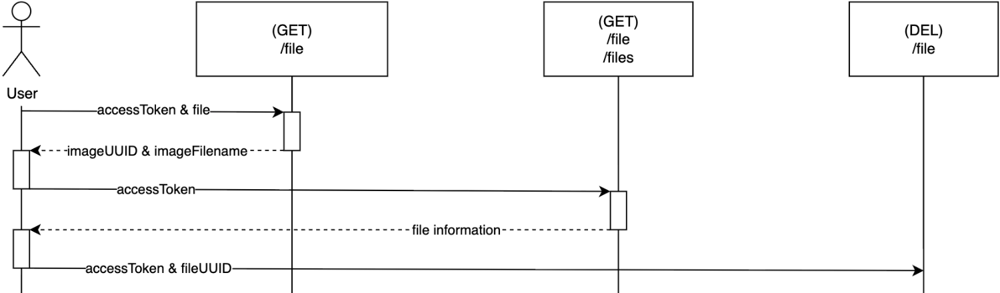

 

# GJU Jobs API
Made by Kaan, Dilan and Khanh 
Project Lead: Silvio Peikert
Auftraggeber: Prof. Dr. GJU typ.

This project is made in cooperation with the GJU im Rahmen des Moduls.... es geht um das alte jobportal abzulösen und den studierenden zu ermöglichen sich zu bewerben und eine bessere kooperation zwischen studierenden und unternehmen zu ermöglichen. , Frontend teammitflieder lead usw zeigen. und projektlead.
Dieses projekt steht unter MIT-Lizens. Dieses projekt wurde angefangen am 2025.01.12. die entwicklung erfolgt unter strnger beachtung von datenschutz und dem industriestandert.

API Tech-lead: Kâan Turan

## Setup:
1. Create .env, .env.production, .env.testing file, use .env.example as a template and configure
2. Configure PostgreSQL
3. Configure Redis
4. npm i
5. npm run test
6. npm run dev

## Important:
Always run **npm run test** before pushing to the master branch.

## Endpoints

A description (string) will always be part of the body. 
The "Response" column only shows the response on success (200).

### General
[ Short description ]

| Method | Title                   | Path                 | Headers | Body                                                              | Params | Response Headers | Response Body              |
|--------|-------------------------|----------------------|---------|-------------------------------------------------------------------|--------|------------------|----------------------------|
| POST   | Support Request         | /support             |         | email: string phone: string type: string message: string |        |                  |                            |
| POST   | Frontend Internal Error | /send-frontend-error |         | errorMessage: string                                              |        |                  | Body: errorUUID: string |

### User
[ Short description ] 
 
 

| Method | Title             | Path                 | Headers              | Body                                                                                                                                                                                                                                                                                                                                                                                                                                                                                                                                                                                                                                                                                       | Params | Response Headers     | Response Body                                                                                                                                                                                                                                                                                                                                                                                                                                                                                                                                                                                                                                                                                                |
|--------|-------------------|----------------------|----------------------|--------------------------------------------------------------------------------------------------------------------------------------------------------------------------------------------------------------------------------------------------------------------------------------------------------------------------------------------------------------------------------------------------------------------------------------------------------------------------------------------------------------------------------------------------------------------------------------------------------------------------------------------------------------------------------------------|--------|----------------------|--------------------------------------------------------------------------------------------------------------------------------------------------------------------------------------------------------------------------------------------------------------------------------------------------------------------------------------------------------------------------------------------------------------------------------------------------------------------------------------------------------------------------------------------------------------------------------------------------------------------------------------------------------------------------------------------------------------|
| POST   | Student Signup    | /user/signup/student |                      | email: string phone: string givenName: string surname: string degree: string \| undefined program: string \| undefined tags: number[] \| undefined jobPreferences: number[] \| undefined languages: number[] \| undefined                                                                                                                                                                                                                                                                                                                                                                                                                                          |        | Authentication Token | expires: string authCode: string                                                                                                                                                                                                                                                                                                                                                                                                                                                                                                                                                                                                                                                                          |
| POST   | Company Signup    | /user/signup/company |                      | email: string phone: string company: string description: string \| undefined givenName: string surname: string street: string streetNumber: string ZIPCode: number city: string country: string size: string industry: string                                                                                                                                                                                                                                                                                                                                                                                                                          |        |                      | expires: string authCode: string                                                                                                                                                                                                                                                                                                                                                                                                                                                                                                                                                                                                                                                                          |
| POST   | Login             | /user/login          |                      | isStudent: boolean email: string                                                                                                                                                                                                                                                                                                                                                                                                                                                                                                                                                                                                                                                        |        | Authentication Token | expires: string authCode: string                                                                                                                                                                                                                                                                                                                                                                                                                                                                                                                                                                                                                                                                          |
| POST   | Auth              | /user/auth           | Authentication Token | code: string                                                                                                                                                                                                                                                                                                                                                                                                                                                                                                                                                                                                                                                                               |        | Authorization Token  |                                                                                                                                                                                                                                                                                                                                                                                                                                                                                                                                                                                                                                                                                                              |
| PATCH  | Update            | /user/update         | Authorization Token  | Student: phone: string \| undefined givenName: string \| undefined surname: string \| undefined degree: string \| undefined program: string \| undefined tags: number[] \| undefined jobPreferences: number[] \| undefined languages: number[] \| undefined  Company: phone: string\| undefined company: string\| undefined description: string\| undefined givenName: string\| undefined surname: string\| undefined street: string\| undefined streetNumber: string\| undefined ZIPCode: number\| undefined city: string\| undefined country: string\| undefined size: string\| undefined industry: string\| undefined |        |                      |                                                                                                                                                                                                                                                                                                                                                                                                                                                                                                                                                                                                                                                                                                              |
| GET    | Retrieve          | /user                | Authorization Token  |                                                                                                                                                                                                                                                                                                                                                                                                                                                                                                                                                                                                                                                                                            |        |                      | Student: user: {     UUID: string     authUUID: string     email: string     phone: string     givenName: string     surname: string     degree: string \| null     program: string \| null     tags: number[]     jobPreferences: number[]     languages: number[] }  Company: user: {     UUID: string     authUUID: string     email: string     phone: string     company: string     description: string \| null     givenName: string     surname: string     street: string     streetNumber: string     ZIPCode: number     city: string     country: string     size: string     industry: string } |
| GET    | Get Recovery Link | /user/recovery       |                      | isStudent: boolean email: string                                                                                                                                                                                                                                                                                                                                                                                                                                                                                                                                                                                                                                                        |        |                      |                                                                                                                                                                                                                                                                                                                                                                                                                                                                                                                                                                                                                                                                                                              |
| POST   | Recovery          | /user/recovery       | Authentication Token |                                                                                                                                                                                                                                                                                                                                                                                                                                                                                                                                                                                                                                                                                            |        |                      |                                                                                                                                                                                                                                                                                                                                                                                                                                                                                                                                                                                                                                                                                                              |
| GET    | Get Deletion Link | /user/deletion       | Authorization Token  |                                                                                                                                                                                                                                                                                                                                                                                                                                                                                                                                                                                                                                                                                            |        |                      |                                                                                                                                                                                                                                                                                                                                                                                                                                                                                                                                                                                                                                                                                                              |
| DEL    | Deletion          | /user/deletion       | Authentication Token |                                                                                                                                                                                                                                                                                                                                                                                                                                                                                                                                                                                                                                                                                            |        |                      |                                                                                                                                                                                                                                                                                                                                                                                                                                                                                                                                                                                                                                                                                                              |

### File
[ Short description ] 

| Method | Title    | Path   | Headers             | Body         | Params       | Response Headers | Response Body                                                               |
|--------|----------|--------|---------------------|--------------|--------------|------------------|-----------------------------------------------------------------------------|
| POST   | Upload   | /file  | Authorization Token | file: Image  | type: string |                  | UUID: string fileName: string                                            |
| GET    | Retrieve | /files | Authorization Token |              |              |                  | files: {     UUID: string     name: string     type: string }[] |
| GET    | Retrieve | /file  | Authorization Token |              | UUID: string |                  | files: {     name: string     type: string     url: string }    |
| DEL    | Delete   | /file  | Authorization Token | uuid: string |              |                  |                                                                             |

### Images
[ Short description ]

| Method | Title | Path                           | Headers | Body | Params | Response Headers | Response Body |
|--------|-------|--------------------------------|---------|------|--------|------------------|---------------|
| GET    | Image | /upload/User UUID/Filename     |         |      |        |                  |               |

### Jobs
[ Short description ] 

| Method | Title    | Path         | Headers             | Body                                                                                                                                                                          | Params                                                             | Response Headers | Response Body                                                                                                                                                                                                                                                                                                                 |
|--------|----------|--------------|---------------------|-------------------------------------------------------------------------------------------------------------------------------------------------------------------------------|--------------------------------------------------------------------|------------------|-------------------------------------------------------------------------------------------------------------------------------------------------------------------------------------------------------------------------------------------------------------------------------------------------------------------------------|
| POST   | Create   | /jobs/create | Authorization Token | title: string description: string tags: number[] \| undefined position: string exp: number \| undefined                                                           |                                                                    |                  | uuid: string                                                                                                                                                                                                                                                                                                                  |
| PATCH  | Update   | /jobs/update | Authorization Token | jobUUID: string title: string \| undefined description: string \| undefined tags: number[] \| undefined position: string \| undefined exp: number \| undefined |                                                                    |                  |                                                                                                                                                                                                                                                                                                                               |
| DEL    | Delete   | /jobs/delete | Authorization Token | jobUUID: string                                                                                                                                                               |                                                                    |                  |                                                                                                                                                                                                                                                                                                                               |
| GET    | Retrieve | /jobs        |                     |                                                                                                                                                                               | tags: number[] sort: string page: number pageSize: number |                  | companyInfo: {     email: string     company: string     size: string     industry: string     country: string } jobs: {     uuid: string     title: string     description: string     position: string     exp: string \| undefined     created: string     tags: number[] }[] |