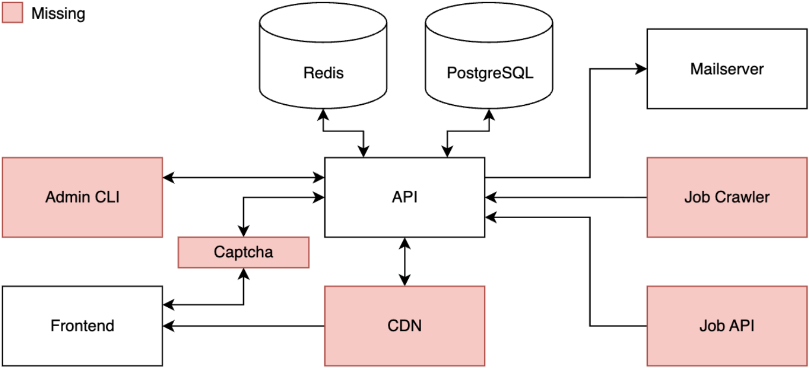
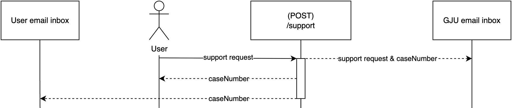
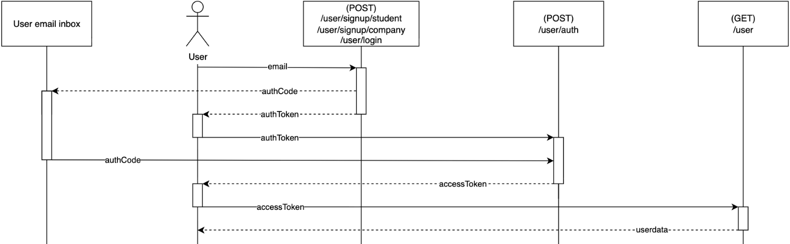
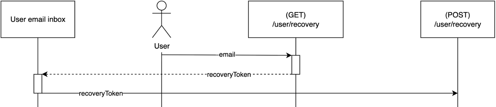
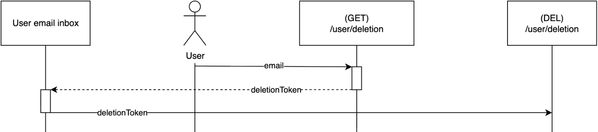
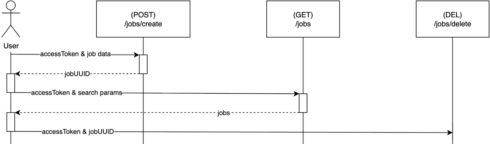
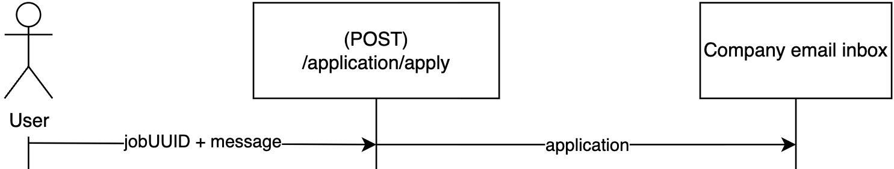

 

# GJU Jobs API
Developed by Khanh Le Dang, Dilan Bostanci and Kâan Turan 
Project lead: Silvio Peikert and Dr. Jamal Al Qundus

GJU Jobs is a matchmaking platform developed in collaboration with the <a href="https://www.gju.edu.jo">German Jordanian University (GJU)</a> and the <a href="https://www.htw-berlin.de">Hochschule für Technik und Wirtschaft Berlin (HTW Berlin) - University of Applied Sciences</a>. The platform aims to connect GJU students with companies in Germany, facilitating access to internships and early career opportunities. Students can create profiles highlighting their academic background, qualifications, and skills, while companies can publish job postings and actively search for suitable candidates. An intelligent matching system recommends relevant opportunities based on academic profiles, competencies, and career interests.

> [!NOTE]  
> This project is licensed under the MIT License. See the _LICENSE_ file for details.

## Project team
| Name                 | Role | Subteam      | Contact                                   |
|----------------------|------|--------------|-------------------------------------------|
| Waindja Bukam Kamseu | Lead | Coordination | waindja.bukamkamseu@student.htw-berlin.de |
| Pham Hoai Linh       |      | Coordination | hoai.pham@student.htw-berlin.de           |
| Natasza Kopka        |      | Coordination | natasza.kopka@student.htw-berlin.de       |
| Kâan Turan           | Lead | Backend      | kaan.turan@student.htw-berlin.de          |
| Khanh Le Dang        |      | Backend      | khanh.dang@student.htw-berlin.de          |
| Dilan Bostanci       |      | Backend      | dilan.bostanci@student.htw-berlin.de      |
| Houman Safiri        | Lead | Frontend     | houman.safiri@student.htw-berlin.de       |
| Sarra Malek          |      | Frontend     | sarra.malek@student.htw-berlin.de         |
| Gizem Biktü          |      | Frontend     | gizem.biliktue@student.htw-berlin.de      |

## Setup:
To get started, follow the steps below to launch the API. The use of Docker is supported.

1. Create the _.env_, _.env.production_, and _.env.testing_ files inside the root directory using _.env.example_ as a template.
2. Configure the environment files for development, deployment, and testing according to the instructions and information provided within each file. Recommended values are already provided in the _.env.example_ file.
3. Set up PostgreSQL and Redis, then configure the environment files with the required connection details. When setting up PostgreSQL, you can use the _schemas/postgreSQL.schema.sql_ file to initialize the database.
4. Install all dependencies with `npm install`.
5. Run `npm run test` to check if everything is working properly.
6. Start the API in development mode: `npm run dev` or start the API in production mode: `npm run deploy`.
7. Done! :blush:

## General
This API is built using the <a href="https://expressjs.com">Express.js</a> framework. To operate the application, a configured <a href="https://www.postgresql.org">PostgreSQL</a> database, <a href="https://redis.io">Redis</a> instance, and mail server are required. The SSL certificate files must be stored in the root directory under /certificates. All additional third-party libraries and dependencies can be found in _/package.json_ and _/package-lock.json_.

The following section provides an overview of the complete system architecture.

 

## Security and Data Handling
User-relevant values stored in the database are encrypted. The database uses connection pooling to ensure efficient resource utilization.
To further enhance security, rate limiting, request timeouts, and individual account-level cooldowns have been implemented. Unauthorized tokens are automatically blacklisted.
Algorithms for compressing uploaded files as well as file integrity checks have been implemented. All uploaded images are normalized into a unified format.
JSON Web Tokens (JWTs) do not expose any personal user information for either students or companies; they contain only UUIDs used internally by the system for identification purposes.
Emails can be sent through secure channels and encrypted if required; this option is configurable via the environment configuration file.
Request payload sizes and numerous additional input validations are performed before any request is processed.

## Environment
The following section lists all environment variables along with a brief description of each. The environment files also include short comments, although most variables are self-explanatory.

| Variable | Description | Recommended |
|----------|-------------|-------------|
| NODE_ENV | Choose between DEV, TESTING or PRODUCTION; When NODE_ENV set to DEV or TESTING, it can be useful to disable features such as RATE_LIMIT, COOLDOWN, and similar restrictions |  |
| VERSION | Avoid dotted version numbers; Frontend and backend must use the same "VERSION" number to properly work together |  |
| DEV_MAIL | Enable mailserver usage if NODE_ENV = DEV enabled |  |
| STARTUP_TESTS | External server tests on compilation (does not include Redis) |  |
| REMOVE_UNNUSED_FOLDERS | Delete all unnused user folders on startup |  |
| API_HTTPS | Enable/disable HTTPS for API |  |
| API_WWW | Enable www. subdomain |  |
| API_HOST | Only the domain name |  |
| API_PORT | Optional |  |
| API_PATH | Optional |  |
| FRONTEND_HTTPS | Enable/disable HTTPS for frontend |  |
| FRONTEND_WWW | Enable www. subdomain |  |
| FRONTEND_HOST | Only the domain name |  |
| FRONTEND_PORT | Optional |  |
| FRONTEND_PATH | Optional |  |
| SCHEMA_NAME | Database schema name |  |
| DB_HOST | Database host |  |
| DB_PORT | Database port |  |
| DB_USER | Database user |  |
| DB_PASSWORD | Database password |  |
| DB_POOL_MAX | Maximum amount of connections | 30 (seconds) |
| DB_POOL_IDLE | Time until inactive connection gets closed | 60 (seconds) |
| DB_POOL_TIMEOUT | Time until timeout | 3 (seconds) |
| MAIL_NAME | E-Mail sender name |  |
| INCOMING_MAILSERVER | Incoming mail server |  |
| OUTGOING_MAILSERVER | Outgoing mail server |  |
| WEBMAIL_SERVER | Webmail server |  |
| MAIL_SMTP_PORT | SMTP port |  |
| MAIL_IMAP_PORT | IMAP port |  |
| MAIL_POP3_PORT | POP3 port |  |
| MAIL_IMAP_SSL_TSL_PORT | IMAP SSL/TLS port |  |
| MAIL_POP3_SSL_TSL_PORT | POP3 SSL/TLS port |  |
| MAIL_PORT_ENCRYPTION | STARTTLS encryption |  |
| MAIL_PORT_ENCRYPTION_SSL_TSL | SSL/TLS encryption |  |
| SYSTEM_EMAIL | System email address |  |
| SYSTEM_EMAIL_PASSWORD | System email password |  |
| NO_REPLY_EMAIL | No-reply email address |  |
| NO_REPLY_EMAIL_PASSWORD | No-reply email password |  |
| SUPPORT_EMAIL | Support email address |  |
| SUPPORT_EMAIL_PASSWORD | Support email password |  |
| AUTH_KEY | Must be exactly 64 characters long |  |
| AUTH_EXP | Auth token expiration | 900 (seconds) |
| AUTH_CODE_LENGTH | Length of auth code | 6 |
| AUTH_MAX_ATTEMPTS | Maximum auth attempts | 5 |
| ACCESS_KEY | Must be exactly 64 characters long |  |
| ACCESS_EXP | JWT access expiration | 15552000 (seconds) |
| RECOVERY_KEY | Must be exactly 64 characters long |  |
| RECOVERY_EXP | Recovery token expiration | 900 (seconds) |
| DELETION_KEY | Must be exactly 64 characters long |  |
| DELETION_EXP | Deletion token expiration | 300 (seconds) |
| BLACKLIST_CLEANUP_INTERVAL | Blacklist cleanup interval | 3600 (seconds) |
| ENCRYPTION_KEY | Must be exactly 64 characters long |  |
| HASH_KEY | Must be exactly 64 characters long |  |
| MAX_CONTENT_SIZE | Maximum client JSON content size per request | 100 (KB) |
| RATE_LIMIT | Enable/disable rate limiting |  |
| HTTP_GLOBAL_WINDOW_MS | HTTP global time window | 60 (seconds) |
| HTTP_GLOBAL_LIMIT | Global request amount per window | 40 |
| SIGNUP_WINDOW_MS | Signup time window | 3600 (seconds) |
| SIGNUP_LIMIT | Maximum signup requests per window | 5 |
| LOGIN_WINDOW_MS | Login time window | 120 (seconds) |
| LOGIN_LIMIT | Maximum login requests per window | 7 |
| GET_RECOVERY_WINDOW_MS | Recovery request time window | 3600 (seconds) |
| GET_RECOVERY_LIMIT | Maximum recovery requests per window | 3 |
| GET_DELETE_WINDOW_MS | Delete request time window | 3600 (seconds) |
| GET_DELETE_LIMIT | Maximum delete requests per window | 3 |
| SUPPORT_WINDOW_MS | Support request time window | 10800 (seconds) |
| SUPPORT_LIMIT | Maximum support requests per window | 3 |
| SEND_FRONTEND_ERROR_WINDOW_MS | Frontend error submission window | 43200 (seconds) |
| SEND_FRONTEND_ERROR_LIMIT | Maximum frontend error submissions per window | 5 |
| WS_WINDOW_MS | WebSocket time window | 60 (seconds) |
| WS_LIMIT | Maximum WebSocket requests per window | 40 |
| GLOBAL_TIMEOUT | Global request timeout | 30 (seconds) |
| UPLOAD_IMAGES_TIMEOUT | Upload images timeout | 60 (seconds) |
| COOLDOWN | Cooldown time | 15 (seconds) |
| UPLOADS_PATH | Folder path for user folders; Empty field would be inside "/api" directory |  |
| IMAGE_TYPES | Allowed image types |  |
| IMAGE_NAME_LENGTH | Image name length | 16 |
| IMAGE_MAX_INIT_DIM | Maximum initial pixel dimensions for uploads | 4000 |
| IMAGE_RESIZE_RATE | Horizontal pixel amount | 700 |
| IMAGE_COMPRESSION_RATE | Image compression amount | 80 |
| PROFILE_PICTURE_MAX_SIZE | Maximum profile picture size | 10 (MB) |
| IMAGE_UPLOAD_PATH | Path where uploads can be retrieved |  |
| USE_CORS | Enable/disable Cross-Origin Resource Sharing |  |
| ALLOWED_STUDENT_DOMAIN | Allowed student domains to signup |  |

## Endpoints
Below, all endpoints are presented along with a sequence diagram. A _description_ (string) will always be included in the response body. The **Response** column only displays the successful response (HTTP 200).

### General
#### User Authentication and Authorization 
 

| Method | Title                   | Path                 | Headers | Body                                                              | Params | Response Headers | Response Body              |
|--------|-------------------------|----------------------|---------|-------------------------------------------------------------------|--------|------------------|----------------------------|
| POST   | Support Request         | /support             |         | email: string phone: string type: string message: string |        |                  |                            |
| POST   | Frontend Internal Error | /send-frontend-error |         | errorMessage: string                                              |        |                  | Body: errorUUID: string |

### User
#### User Authentication and Authorization 
 
#### User Recovery 
 
#### User Deletion 

| Method | Title             | Path                 | Headers              | Body                                                                                                                                                                                                                                                                                                                                                                                                                                                                                                                                                                                                                                                                                       | Params | Response Headers     | Response Body                                                                                                                                                                                                                                                                                                                                                                                                                                                                                                                                                                                                                                                                                                |
|--------|-------------------|----------------------|----------------------|--------------------------------------------------------------------------------------------------------------------------------------------------------------------------------------------------------------------------------------------------------------------------------------------------------------------------------------------------------------------------------------------------------------------------------------------------------------------------------------------------------------------------------------------------------------------------------------------------------------------------------------------------------------------------------------------|--------|----------------------|--------------------------------------------------------------------------------------------------------------------------------------------------------------------------------------------------------------------------------------------------------------------------------------------------------------------------------------------------------------------------------------------------------------------------------------------------------------------------------------------------------------------------------------------------------------------------------------------------------------------------------------------------------------------------------------------------------------|
| POST   | Student Signup    | /user/signup/student |                      | email: string phone: string givenName: string surname: string degree: string \| undefined program: string \| undefined tags: number[] \| undefined jobPreferences: number[] \| undefined languages: number[] \| undefined                                                                                                                                                                                                                                                                                                                                                                                                                                          |        | Authentication Token | expires: string authCode: string                                                                                                                                                                                                                                                                                                                                                                                                                                                                                                                                                                                                                                                                          |
| POST   | Company Signup    | /user/signup/company |                      | email: string phone: string company: string description: string \| undefined givenName: string surname: string street: string streetNumber: string ZIPCode: number city: string country: string size: string industry: string                                                                                                                                                                                                                                                                                                                                                                                                                          |        |                      | expires: string authCode: string                                                                                                                                                                                                                                                                                                                                                                                                                                                                                                                                                                                                                                                                          |
| POST   | Login             | /user/login          |                      | isStudent: boolean email: string                                                                                                                                                                                                                                                                                                                                                                                                                                                                                                                                                                                                                                                        |        | Authentication Token | expires: string authCode: string                                                                                                                                                                                                                                                                                                                                                                                                                                                                                                                                                                                                                                                                          |
| POST   | Auth              | /user/auth           | Authentication Token | code: string                                                                                                                                                                                                                                                                                                                                                                                                                                                                                                                                                                                                                                                                               |        | Authorization Token  |                                                                                                                                                                                                                                                                                                                                                                                                                                                                                                                                                                                                                                                                                                              |
| PATCH  | Update            | /user/update         | Authorization Token  | Student: phone: string \| undefined givenName: string \| undefined surname: string \| undefined degree: string \| undefined program: string \| undefined tags: number[] \| undefined jobPreferences: number[] \| undefined languages: number[] \| undefined  Company: phone: string\| undefined company: string\| undefined description: string\| undefined givenName: string\| undefined surname: string\| undefined street: string\| undefined streetNumber: string\| undefined ZIPCode: number\| undefined city: string\| undefined country: string\| undefined size: string\| undefined industry: string\| undefined |        |                      |                                                                                                                                                                                                                                                                                                                                                                                                                                                                                                                                                                                                                                                                                                              |
| GET    | Retrieve          | /user                | Authorization Token  |                                                                                                                                                                                                                                                                                                                                                                                                                                                                                                                                                                                                                                                                                            |        |                      | Student: user: {     UUID: string     authUUID: string     email: string     phone: string     givenName: string     surname: string     degree: string \| null     program: string \| null     tags: number[]     jobPreferences: number[]     languages: number[] }  Company: user: {     UUID: string     authUUID: string     email: string     phone: string     company: string     description: string \| null     givenName: string     surname: string     street: string     streetNumber: string     ZIPCode: number     city: string     country: string     size: string     industry: string } |
| GET    | Get Recovery Link | /user/recovery       |                      | isStudent: boolean email: string                                                                                                                                                                                                                                                                                                                                                                                                                                                                                                                                                                                                                                                        |        |                      |                                                                                                                                                                                                                                                                                                                                                                                                                                                                                                                                                                                                                                                                                                              |
| POST   | Recovery          | /user/recovery       | Authentication Token |                                                                                                                                                                                                                                                                                                                                                                                                                                                                                                                                                                                                                                                                                            |        |                      |                                                                                                                                                                                                                                                                                                                                                                                                                                                                                                                                                                                                                                                                                                              |
| GET    | Get Deletion Link | /user/deletion       | Authorization Token  |                                                                                                                                                                                                                                                                                                                                                                                                                                                                                                                                                                                                                                                                                            |        |                      |                                                                                                                                                                                                                                                                                                                                                                                                                                                                                                                                                                                                                                                                                                              |
| DEL    | Deletion          | /user/deletion       | Authentication Token |                                                                                                                                                                                                                                                                                                                                                                                                                                                                                                                                                                                                                                                                                            |        |                      |                                                                                                                                                                                                                                                                                                                                                                                                                                                                                                                                                                                                                                                                                                              |

### File
#### User File 

| Method | Title    | Path   | Headers             | Body         | Params       | Response Headers | Response Body                                                               |
|--------|----------|--------|---------------------|--------------|--------------|------------------|-----------------------------------------------------------------------------|
| POST   | Upload   | /file  | Authorization Token | file: Image  | type: string |                  | UUID: string fileName: string                                            |
| GET    | Retrieve | /files | Authorization Token |              |              |                  | files: {     UUID: string     name: string     type: string }[] |
| GET    | Retrieve | /file  | Authorization Token |              | UUID: string |                  | files: {     name: string     type: string     url: string }    |
| DEL    | Delete   | /file  | Authorization Token | uuid: string |              |                  |                                                                             |

### Images

| Method | Title | Path                           | Headers | Body | Params | Response Headers | Response Body |
|--------|-------|--------------------------------|---------|------|--------|------------------|---------------|
| GET    | Image | /upload/User UUID/Filename     |         |      |        |                  |               |

### Jobs
#### User Jobs 

| Method | Title             | Path         | Headers             | Body                                                                                                                                                                                                           | Params                                                             | Response Headers | Response Body                                                                                                                                                                                                                                                                                                                                         |
|--------|-------------------|--------------|---------------------|----------------------------------------------------------------------------------------------------------------------------------------------------------------------------------------------------------------|--------------------------------------------------------------------|------------------|-------------------------------------------------------------------------------------------------------------------------------------------------------------------------------------------------------------------------------------------------------------------------------------------------------------------------------------------------------|
| POST   | Create            | /jobs/create | Authorization Token | title: string description: string tags: number[] \| undefined location: string position: string exp: number \| undefined                                                                        |                                                                    |                  | uuid: string                                                                                                                                                                                                                                                                                                                                          |
| PATCH  | Update            | /jobs/update | Authorization Token | jobUUID: string title: string \| undefined description: string \| undefined location: string \| undefined tags: number[] \| undefined position: string \| undefined exp: number \| undefined |                                                                    |                  |                                                                                                                                                                                                                                                                                                                                                       |
| DEL    | Delete            | /jobs/delete | Authorization Token | jobUUID: string                                                                                                                                                                                                |                                                                    |                  |                                                                                                                                                                                                                                                                                                                                                       |
| GET    | Retrieve          | /jobs        |                     |                                                                                                                                                                                                                | tags: number[] sort: string page: number pageSize: number |                  | companyInfo: {     email: string     company: string     size: string     industry: string     country: string } jobs: {     uuid: string     title: string     description: string     location: string     tags: number[]     position: string     exp: string \| undefined     created: string }[] |
| GET    | Retrieve own jobs | /jobs/own    | Authorization Token |                                                                                                                                                                                                                |                                                                    |                  | jobs: {     uuid: string     title: string     description: string     location: string     position: string     exp: string \| undefined     created: string     tags: number[] }[]                                                                                                                                       |

### Application
#### Job Application 

| Method | Title                                  | Path                          | Headers             | Body                               | Params | Response Headers | Response Body                                                                                                                                                                                                                                                                                                                                                                                                                                                                                       |
|--------|----------------------------------------|-------------------------------|---------------------|------------------------------------|--------|------------------|-----------------------------------------------------------------------------------------------------------------------------------------------------------------------------------------------------------------------------------------------------------------------------------------------------------------------------------------------------------------------------------------------------------------------------------------------------------------------------------------------------|
| POST   | Apply for Job                          | /application/apply            | Authorization Token | jobUUID: string message: string |        |                  |                                                                                                                                                                                                                                                                                                                                                                                                                                                                                                     |
| GET    | Retrieve received Company Applications | /application/retrieve/company | Authorization Token | jobUUID: string                    |        |                  | applications: {     uuid: string     givenName: string     surname: string     degree: string \| undefined     program: string \| undefined     cv: string \| undefined     message: string \| undefined     email: string     phone: string \| undefined }[]                                                                                                                                                                                                         |
| GET    | Retrieve applied Student Applications  | /application/retrieve/student | Authorization Token |                                    |        |                  | applied: {     jobInfo: {         uuid: string         title: string         description: string  location: string         position: string         exp: string \| undefined         created: string         tags: number[]     }     companyInfo: {         email: string         company: string         size: string         industry: string         country: string     }     studentInfo: {         message?: string     } }[] |